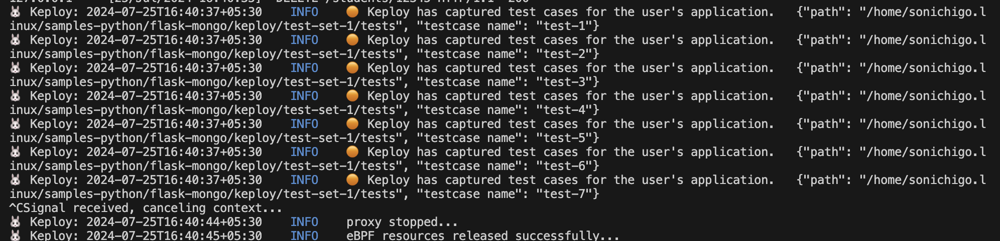
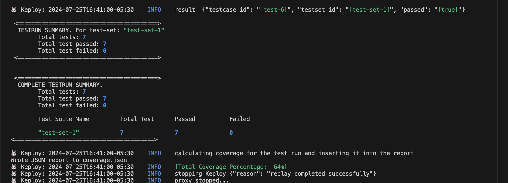

# Flask-Mongo Sample Application

This application is a simple student management API built using Python's Flask framework and MongoDB for data storage. It allows you to perform basic CRUD (Create, Read, Update, Delete) operations on student records. The API supports CORS (Cross-Origin Resource Sharing) to facilitate cross-domain requests.


# Introduction

🪄 Dive into the world of Student CRUD Apps and see how seamlessly Keploy integrated with [Flask](https://flask.palletsprojects.com/en/3.0.x/) and [MongoDB](https://www.mongodb.com/). Buckle up, it's gonna be a fun ride! 🎢

## Pre-Requisite 🛠️

- Install WSL (`wsl --install`) for  Windows.

### Windows (PowerShell) Notes 🪟

If you are using Windows with PowerShell, some Linux/macOS commands in this guide may not work directly.

- If you are using a Python virtual environment, activate it using:
  ```powershell
  .\venv\Scripts\Activate.ps1
  ```

Install dependencies using 'pip' (instead of 'pip3'):

```powershell
pip install -r requirements.txt
```

If you encounter script execution errors, ensure that PowerShell execution policy allows running local scripts.
#### Optional 🛠️

- Install Colima( `brew install colima && colima start` ) for  MacOs.

## Install Keploy

- Install Keploy CLI using the following command:

```bash
curl -O -L https://keploy.io/install.sh && source install.sh
```

## Get Started! 🎬

## Setup the MongoDB Database 📦

Create a docker network, run -

```bash
docker network create backend
```

Start the MongoDB instance-

```bash
docker run -p 27017:27017 -d --network backend --name mongo mongo
```

### Using MongoDB Atlas (Optional) ☁️

Instead of running MongoDB locally or via Docker, you can also use **MongoDB Atlas**, a free cloud-hosted MongoDB service.

If you are using MongoDB Atlas:

1. Create a free cluster on MongoDB Atlas.
2. Obtain the connection string (SRV format), for example:

```
mongodb+srv://<username>:<password>@cluster0.mongodb.net/studentsdb
```

3. Install the required SRV dependency:
```bash
pip install "pymongo[srv]"
```

Replace the MongoDB connection URL in the application with your Atlas connection string.

⚠️ **Important Note on MongoDB Passwords**

If your MongoDB password contains special characters such as @, :, /, or #, the connection string may fail with an InvalidURI error.

To avoid this:

- Use alphanumeric passwords, or
- URL-encode the password before adding it to the connection string (for example, using `urllib.parse.quote_plus` in Python).

## Clone a simple Student Management API 🧪

```bash
git clone https://github.com/keploy/samples-python.git && cd samples-python/flask-mongo

# For Linux/WSL users:
pip3 install -r requirements.txt

# For Windows (PowerShell) users:
# .\venv\Scripts\Activate.ps1  <-- Activate your virtual environment first
pip install -r requirements.txt
```

## Installation 📥

  ### With Docker 🎥

  Build the app image:

  ```sh
  docker build -t flask-app:1.0 .
  ```

  Capture the test-cases-

  ```shell
  keploy record -c "docker run -p 6000:6000 --name flask-app --network backend flask-app:1.0"
  ```

  🔥 **Make some API calls.** Postman, Hoppscotch or even curl - take your pick!

  Let's make URLs short and sweet:

### Port Configuration Note ⚙️

The application commonly runs on port `6000`, but if that port is already in use, Flask may automatically switch to another available port.

Always check the terminal output for a line similar to:

```
Running on http://127.0.0.1:<port>
```

Use the displayed port number when making API calls with `curl`, Postman, or other tools.

  ### Generate testcases

  To generate testcases we just need to **make some API calls.**

  **1. Make a POST request**

  ```bash
  curl -X POST -H "Content-Type: application/json" -d '{"student_id": "12345", "name": "John Doe", "age": 20}' http://localhost:6000/students
  ```

  Let's add one more student: 

  ```sh
  curl -X POST -H "Content-Type: application/json" -d '{"student_id": "12346", "name": "Alice Green", "age": 22}' http://localhost:6000/students
  ```

  **2. Make a GET request**

  ```bash
  curl http://localhost:6000/students
  ```

  **3. Make a PUT request**

  ```bash
  curl -X PUT -H "Content-Type: application/json" -d '{"name": "Jane Smith", "age": 21}' http://localhost:6000/students/12345
  ```

  **4. Make a GET request**

  ```bash
  curl http://localhost:6000/students/12345
  ```

  **5. Make a DELETE request**

  ```bash
  curl -X DELETE http://localhost:6000/students/12345
  ```

  Give yourself a pat on the back! With that simple spell, you've conjured up a test case with a mock! Explore the **Keploy directory** and you'll discover your handiwork in `test-1.yml` and `mocks.yml`.

  ```yaml
  version: api.keploy.io/v1beta2
  kind: Http
  name: test-1
  spec:
    metadata: {}
    req:
      method: POST
      proto_major: 1
      proto_minor: 1
      url: http://localhost:6000/students
      header:
        Accept: "*/*"
        Content-Length: "56"
        Content-Type: application/json
        Host: localhost:6000
        User-Agent: curl/7.81.0
      body: '{"student_id": "12344", "name": "John Doeww", "age": 10}'
      body_type: ""
      timestamp: 2023-11-13T13:02:32.241333562Z
    resp:
      status_code: 200
      header:
        Content-Length: "48"
        Content-Type: application/json
        Date: Mon, 13 Nov 2023 13:02:32 GMT
        Server: Werkzeug/2.2.2 Python/3.9.18
      body: |
        {
          "message": "Student created successfully"
        }
      body_type: ""
      status_message: ""
      proto_major: 0
      proto_minor: 0
      timestamp: 2023-11-13T13:02:34.752123715Z
    objects: []
    assertions:
      noise:
        - header.Date
    created: 1699880554
  curl: |-
    curl --request POST \
      --url http://localhost:6000/students \
      --header 'Host: localhost:6000' \
      --header 'User-Agent: curl/7.81.0' \
      --header 'Accept: */*' \
      --header 'Content-Type: application/json' \
      --data '{"student_id": "12344", "name": "John Doeww", "age": 10}'
  ```

  This is how `mocks.yml` generated would look like:-

  ```yaml
  version: api.keploy.io/v1beta2
  kind: Mongo
  name: mocks
  spec:
    metadata:
      operation: '{ OpMsg flags: 0, sections: [{ SectionSingle msg: {"find":"students","filter":{"student_id":"12345"},"projection":{"_id":{"$numberInt":"0"}},"limit":{"$numberInt":"1"},"singleBatch":true,"lsid":{"id":{"$binary":{"base64":"vPKsEFRdTLytlbnyVimqIA==","subType":"04"}}},"$db":"studentsdb"} }], checksum: 0 }'
    requests:
      - header:
          length: 187
          requestId: 2127584089
          responseTo: 0
          Opcode: 2013
        message:
          flagBits: 0
          sections:
            - '{ SectionSingle msg: {"find":"students","filter":{"student_id":"12345"},"projection":{"_id":{"$numberInt":"0"}},"limit":{"$numberInt":"1"},"singleBatch":true,"lsid":{"id":{"$binary":{"base64":"vPKsEFRdTLytlbnyVimqIA==","subType":"04"}}},"$db":"studentsdb"} }'
          checksum: 0
        read_delay: 3469848802
    responses:
      - header:
          length: 166
          requestId: 154
          responseTo: 2127584089
          Opcode: 2013
        message:
          flagBits: 0
          sections:
            - '{ SectionSingle msg: {"cursor":{"firstBatch":[{"student_id":"12345","name":"John Doe","age":{"$numberInt":"20"}}],"id":{"$numberLong":"0"},"ns":"studentsdb.students"},"ok":{"$numberDouble":"1.0"}} }'
          checksum: 0
        read_delay: 869555
    created: 1699880576
    reqTimestampMock: 2023-11-13T13:02:56.385067848Z
    resTimestampMock: 2023-11-13T13:02:56.386374941Z
  ```

  Want to see if everything works as expected?

  #### Run Tests

  Time to put things to the test 🧪

  ```shell
  keploy test -c "sudo docker run -p 6000:6000 --rm --network backend --name flask-app flask-app:1.0" --delay 10
  ```

  > The `--delay` flag? Oh, that's just giving your app a little breather (in seconds) before the test cases come knocking.

  Final thoughts? Dive deeper! Try different API calls, tweak the DB response in the `mocks.yml`, or fiddle with the request or response in `test-x.yml`. Run the tests again and see the magic unfold!✨👩‍💻👨‍💻✨

  ## Wrapping it up 🎉

  Congrats on the journey so far! You've seen Keploy's power, flexed your coding muscles, and had a bit of fun too! Now, go out there and keep exploring, innovating, and creating! Remember, with the right tools and a sprinkle of fun, anything's possible.😊🚀

  Happy coding! ✨👩‍💻👨‍💻✨

---

  ## Running In Linux/WSL
  We'll be running our sample application right on Linux, but just to make things a tad more thrilling, we'll have the database (PostgreSQL) chill on Docker. Ready? Let's get the party started!🎉

  ### 📼 Roll the Tape - Recording Time!

  Install the dependencies:

  ```bash
  # For Linux/WSL:
  pip3 install -r requirements.txt

  # For Windows (PowerShell):
  .\venv\Scripts\Activate.ps1
  pip install -r requirements.txt
  ```

  Now, let's Capture the test-cases-

  In `app.py`, replace the MongoDB connection URL with - `mongodb://0.0.0.0:27017/`

  Ready, set, record! Here's how:

  ```bash
  keploy record -c "python3 app.py"
  ```

  Keep an eye out for the `-c `flag! It's the command charm to run the app.

  Alright, magician! With the app alive and kicking, let's weave some test cases. The spell? Making some API calls! Postman, Hoppscotch, or the classic curl - pick your wand.

  ### Generate testcases

  To generate testcases we just need to **make some API calls.**

  **1. Make a POST request**

    ```bash
  curl -X POST -H "Content-Type: application/json" -d '{"student_id": "12345", "name": "John Doe", "age": 20}' http://localhost:6000/students
  ```

  Let's add one more student: 

  ```sh
  curl -X POST -H "Content-Type: application/json" -d '{"student_id": "12346", "name": "Alice Green", "age": 22}' http://localhost:6000/students
  ```

  **2. Make a GET request**

  ```bash
  curl http://localhost:6000/students
  ```

  **3. Make a PUT request**

  ```bash
  curl -X PUT -H "Content-Type: application/json" -d '{"name": "Jane Smith", "age": 21}' http://localhost:6000/students/12345
  ```

  **4. Make a GET request**

  ```bash
  curl http://localhost:6000/students/12345
  ```

  **5. Make a DELETE request**

  ```bash
  curl -X DELETE http://localhost:6000/students/12345
  ```

  Give yourself a pat on the back! With that simple spell, you've conjured up a test case with a mock! Explore the **Keploy directory** and you'll discover your handiwork in `test-1.yml` and `mocks.yml`.

  ```yaml
  version: api.keploy.io/v1beta2
  kind: Http
  name: test-1
  spec:
    metadata: {}
    req:
      method: POST
      proto_major: 1
      proto_minor: 1
      url: http://localhost:6000/students
      header:
        Accept: "*/*"
        Content-Length: "56"
        Content-Type: application/json
        Host: localhost:6000
        User-Agent: curl/7.81.0
      body: '{"student_id": "12344", "name": "John Doeww", "age": 10}'
      body_type: ""
      timestamp: 2023-11-13T13:02:32.241333562Z
    resp:
      status_code: 200
      header:
        Content-Length: "48"
        Content-Type: application/json
        Date: Mon, 13 Nov 2023 13:02:32 GMT
        Server: Werkzeug/2.2.2 Python/3.9.18
      body: |
        {
          "message": "Student created successfully"
        }
      body_type: ""
      status_message: ""
      proto_major: 0
      proto_minor: 0
      timestamp: 2023-11-13T13:02:34.752123715Z
    objects: []
    assertions:
      noise:
        - header.Date
    created: 1699880554
  curl: |-
    curl --request POST \
      --url http://localhost:6000/students \
      --header 'Host: localhost:6000' \
      --header 'User-Agent: curl/7.81.0' \
      --header 'Accept: */*' \
      --header 'Content-Type: application/json' \
      --data '{"student_id": "12344", "name": "John Doeww", "age": 10}'
  ```

  This is how `mocks.yml` generated would look like:-

  ```yaml
  version: api.keploy.io/v1beta2
  kind: Mongo
  name: mocks
  spec:
    metadata:
      operation: '{ OpMsg flags: 0, sections: [{ SectionSingle msg: {"find":"students","filter":{"student_id":"12345"},"projection":{"_id":{"$numberInt":"0"}},"limit":{"$numberInt":"1"},"singleBatch":true,"lsid":{"id":{"$binary":{"base64":"vPKsEFRdTLytlbnyVimqIA==","subType":"04"}}},"$db":"studentsdb"} }], checksum: 0 }'
    requests:
      - header:
          length: 187
          requestId: 2127584089
          responseTo: 0
          Opcode: 2013
        message:
          flagBits: 0
          sections:
            - '{ SectionSingle msg: {"find":"students","filter":{"student_id":"12345"},"projection":{"_id":{"$numberInt":"0"}},"limit":{"$numberInt":"1"},"singleBatch":true,"lsid":{"id":{"$binary":{"base64":"vPKsEFRdTLytlbnyVimqIA==","subType":"04"}}},"$db":"studentsdb"} }'
          checksum: 0
        read_delay: 3469848802
    responses:
      - header:
          length: 166
          requestId: 154
          responseTo: 2127584089
          Opcode: 2013
        message:
          flagBits: 0
          sections:
            - '{ SectionSingle msg: {"cursor":{"firstBatch":[{"student_id":"12345","name":"John Doe","age":{"$numberInt":"20"}}],"id":{"$numberLong":"0"},"ns":"studentsdb.students"},"ok":{"$numberDouble":"1.0"}} }'
          checksum: 0
        read_delay: 869555
    created: 1699880576
    reqTimestampMock: 2023-11-13T13:02:56.385067848Z
    resTimestampMock: 2023-11-13T13:02:56.386374941Z
  ```
  
  On terminal we can see the testcases generated -

  

  #### Run Tests

  Time to put things to the test 🧪

  ```shell
  keploy test -c "python3 app.py" --delay 10
  ```
  

  > The `--delay` flag? Oh, that's just giving your app a little breather (in seconds) before the test cases come knocking.

  Final thoughts? Dive deeper! Try different API calls, tweak the DB response in the `mocks.yml`, or fiddle with the request or response in `test-x.yml`. Run the tests again and see the magic unfold!✨👩‍💻👨‍💻✨

  ## Wrapping it up 🎉

  Congrats on the journey so far! You've seen Keploy's power, flexed your coding muscles, and had a bit of fun too! Now, go out there and keep exploring, innovating, and creating! Remember, with the right tools and a sprinkle of fun, anything's possible. 😊🚀

  Happy coding! ✨👩‍💻👨‍💻✨